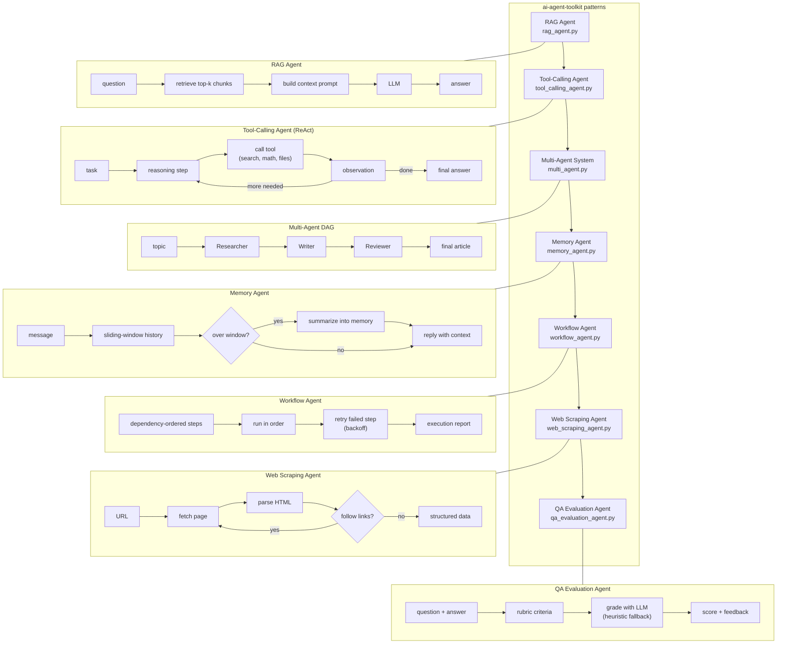

# ai-agent-toolkit

Production-grade agent patterns using LangChain and LangGraph. This toolkit contains practical implementations of common agentic workflows, including RAG, autonomous tool use, and multi-agent orchestration.

## Agent Patterns

- **RAG Agent** (agents/rag_agent.py): Scalable retrieval-augmented generation for document-based QA.
- **Tool-Calling Agent** (agents/tool_calling_agent.py): Autonomous agent capable of using search, math, and file system tools.
- **Multi-Agent System** (agents/multi_agent.py): Directed acyclic graph (DAG) orchestration using Researcher, Writer, and Reviewer nodes.
- **Memory Agent** (agents/memory_agent.py): Stateful conversational agent with sliding-window history and auto-summarization.
- **Workflow Agent** (agents/workflow_agent.py): Dependency-ordered step runner with retries and an execution report.
- **Web Scraping Agent** (agents/web_scraping_agent.py): Fetches, parses and crawls pages with no LLM required.
- **QA Evaluation Agent** (agents/qa_evaluation_agent.py): Scores answers against a rubric (LLM-graded, with an offline heuristic fallback).

## Architecture

How the seven patterns relate. Shared plumbing (config, LLM factory, usage tracking) lives in `utils/`; each pattern is a standalone module in `agents/` with its own offline test coverage.



The project follows a standard modular structure for easy integration:

```text
ai-agent-toolkit/
├── agents/             # Core agent implementations
├── utils/              # Configuration and LLM factory wrappers
├── tests/              # Offline pytest suite (no API keys needed)
├── examples/           # Integration demos
├── docs/               # Architecture and design specs
└── requirements.txt    # Project dependencies
```

## Setup

Requires Python 3.10 or newer.

```bash
# Install dependencies
pip install -r requirements.txt

# Environment Setup
cp .env.example .env
# Configure OPENAI_API_KEY and TAVILY_API_KEY in .env
```

## Quick Start

Individual agents can be tested as standalone modules:

```bash
# Run RAG demo
python -m agents.rag_agent -q "Explain the core concepts of RAG"

# Run Tool-Calling demo
python -m agents.tool_calling_agent -q "What is 15% of 2340?"

# Run Multi-Agent demo
python -m agents.multi_agent -t "Advancements in LLM Orchestration"
```

Or use an agent from Python:

```python
from agents.workflow_agent import WorkflowAgent

wf = WorkflowAgent("demo")
wf.add_step("load", lambda url: url.upper(), inputs=["url"])
wf.add_step("size", lambda load: len(load), depends_on=["load"])
print(wf.run(url="abc")["state"])   # {'load': 'ABC', 'size': 3}
```

For a comprehensive demonstration of all patterns, refer to `examples/quickstart.py`.

## Evaluation harness

`examples/eval_harness.py` runs all seven patterns against a fixed task set and
prints a comparison table. It is fully offline: deterministic stub LLMs stand
in for the real model, a lexical fake embedding stands in for the embedding
service, and the web-scraping tasks use local fixture data, so results are
reproducible with no API keys and no network access. The harness measures what
each pattern actually does (RAG retrieval hit rate, real calculator tool
execution, cross-turn memory recall, rubric discrimination, extraction checks,
workflow retries) rather than LLM answer quality.

```bash
python -m examples.eval_harness              # run all seven patterns
python -m examples.eval_harness -p rag       # run one pattern
python -m examples.eval_harness --list       # show the fixed task set
```

It exits 0 when every task passes and 1 otherwise, and one broken pattern
cannot abort the rest of the table.

### Agent config files

The tool-calling agent accepts a YAML config file for its defaults, so you do
not have to repeat long CLI flags:

```bash
python -m agents.tool_calling_agent -q "What is 15% of 2340?" -c examples/agent_config.yaml
```

The file can set `model`, `max_rounds`, and `tools` (a subset of the built-in
tools). Missing keys fall back to the built-in defaults, and explicit CLI
flags (`--model`, `--max-rounds`) override the config file. Copy
`examples/agent_config.yaml` to get started.

## Testing

The test suite uses fake LLMs and mocked network calls, so it needs no API keys and no internet:

```bash
pip install pytest
python -m pytest tests/ -v
```

## License

MIT. See [LICENSE](LICENSE).

---

**Manoj Kumar Kagitha**
[GitHub](https://github.com/kagithamanoj)